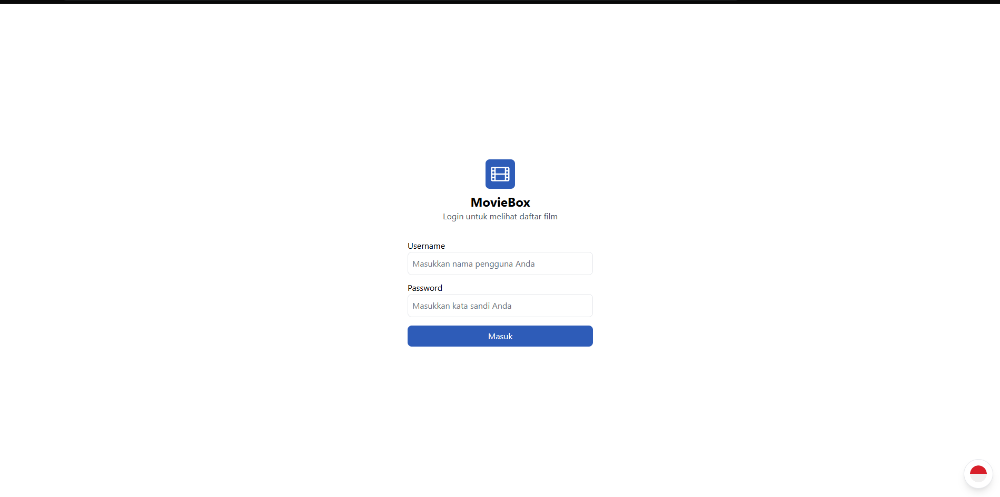
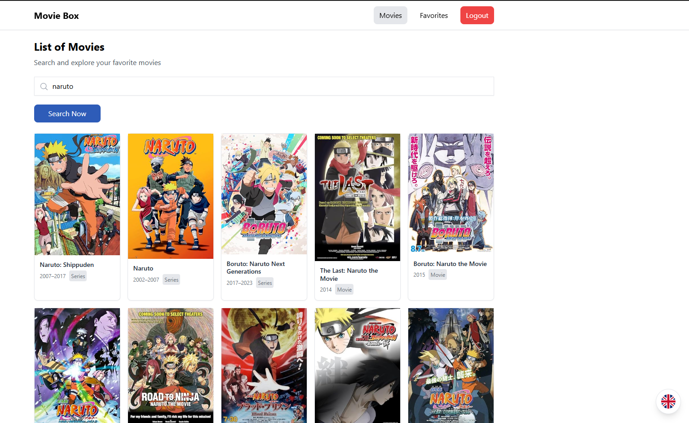
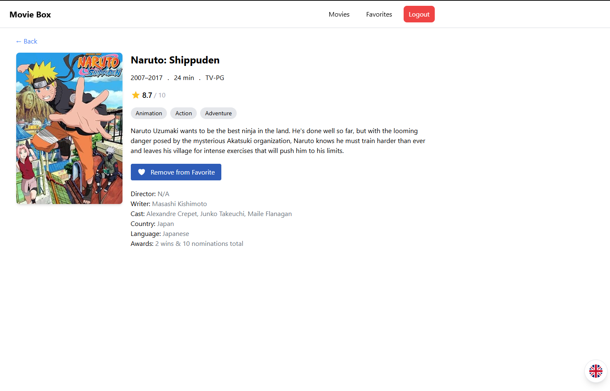
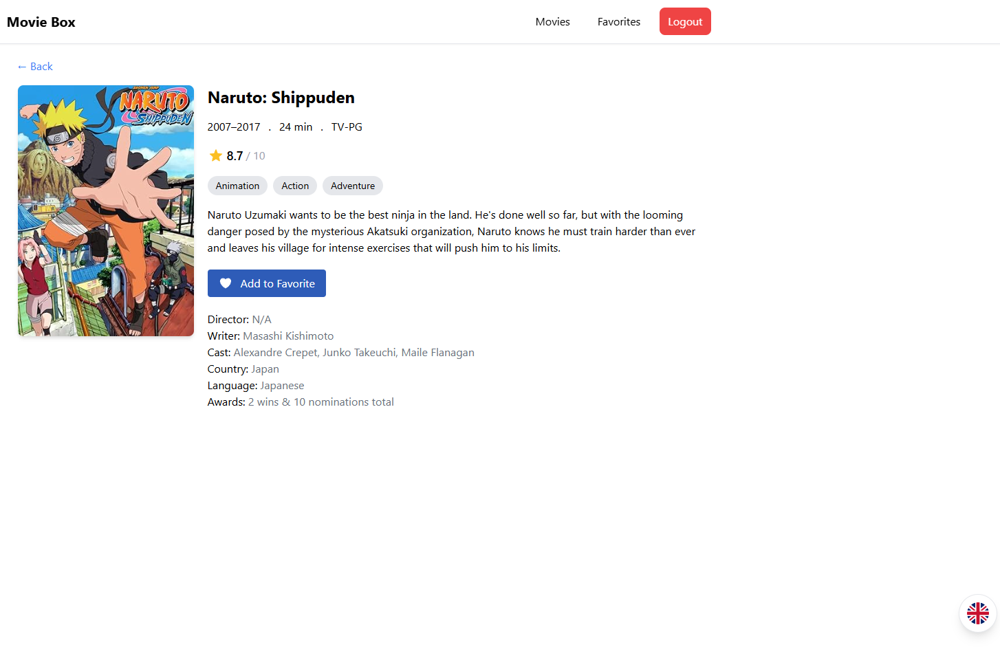
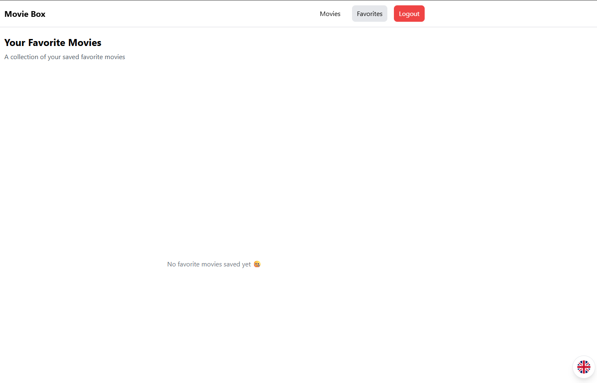
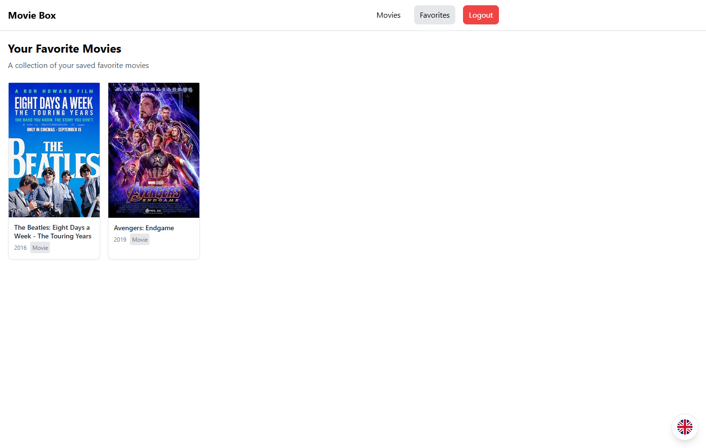

# Aplikasi Movie - Integrasi OMDb API (Laravel 5)

## Deskripsi Project

MovieBox adalah aplikasi web pencarian film berbasis **Laravel 5** yang terintegrasi dengan **OMDb API**.  
Aplikasi ini memungkinkan user untuk mencari film, melihat detail film, serta mengelola daftar film favorit dengan pengalaman UI yang modern dan ringan.

Project ini dikembangkan sebagai **personal project** untuk mengeksplorasi integrasi API eksternal, infinite scroll, multi-language support, dan manajemen state sederhana menggunakan Laravel dan Alpine.js.

---

## Fitur Aplikasi

### 1. Login

-   User wajib login sebelum mengakses halaman List Movie dan Detail Movie.
-   Credential:
    -   Username: yoga
    -   Password: 12345
-   Jika credential salah, sistem menampilkan pesan error.

### 2. List Movie

-   Pencarian film berdasarkan judul.
-   Implementasi Infinite Scroll.
-   Implementasi Lazy Load untuk gambar film.
-   Tambah film ke daftar Favorite.
-   Menampilkan empty layout jika data tidak ditemukan.

### 3. Detail Movie

-   Menampilkan informasi detail film dari OMDb API.
-   Tambah / Hapus film dari daftar Favorite.

### 4. Favorite Movie

-   Menampilkan daftar film yang telah ditambahkan ke favorit.
-   User dapat menghapus film dari daftar favorit.

### 5. Multi Language (EN / ID)

-   Default bahasa: English (EN).
-   User dapat mengganti bahasa ke Bahasa Indonesia (ID).
-   Lokalisasi hanya diterapkan pada teks statis.
-   Data dari OMDb API tidak dilakukan lokalisasi.

---

## Teknologi & Library

### Backend

-   Laravel 5
-   GuzzleHttp (untuk integrasi OMDb API)

### Frontend

-   Tailwind CSS v2
-   Alpine.js
-   Blade Template Engine

---

## Arsitektur

Aplikasi menggunakan pola MVC (Model-View-Controller):

-   Controller:

    -   Mengelola request OMDb API menggunakan Guzzle.
    -   Mengatur proses login.
    -   Mengatur logika favorite movie.

-   View:

    -   Menggunakan Blade Template.
    -   Styling menggunakan Tailwind CSS.
    -   Interaksi dinamis menggunakan Alpine.js.

-   Route:
    -   Menggunakan middleware untuk membatasi akses sebelum login.

---

## Implementasi Infinite Scroll

Infinite Scroll diimplementasikan dengan:

-   Event listener window scroll.
-   Pengecekan posisi scroll terhadap tinggi halaman.
-   Increment parameter page.
-   Fetch data berikutnya dari OMDb API.
-   Append data ke dalam list menggunakan Alpine.js.

---

## Implementasi Keamanan

-   Middleware untuk proteksi halaman.
-   Session-based login.
-   Validasi credential.
-   User wajib login sebelum mengakses List dan Detail Movie.

---

## Integrasi OMDb API

-   API Key diperoleh dari http://www.omdbapi.com/
-   Request dilakukan menggunakan GuzzleHttp.
-   Mendukung parameter:
    -   s (search berdasarkan judul)
    -   page (untuk infinite scroll)

---

## Cara Instalasi

1. Download / clone project.
2. Jalankan perintah berikut di folder project:

composer install

3. Atur konfigurasi database di file .env:

DB_DATABASE=moviebox
DB_USERNAME=root  
DB_PASSWORD=

Pastikan database sudah dibuat terlebih dahulu.

4. Tambahkan API Key OMDb ke file .env:

OMDB_API_KEY=your_api_key_here

5. Generate application key:

php artisan key:generate

6. Jalankan migrasi database:

php artisan migrate

7. Jika menggunakan seeder, jalankan:

php artisan db:seed

Atau jalankan sekaligus:

php artisan migrate --seed

8. Jalankan server:

php artisan serve

Akses aplikasi melalui:

http://127.0.0.1:8000/

---

## Screenshot Aplikasi

---
